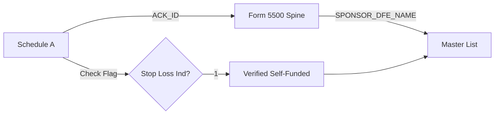

# 💰 V3 Funding Logic: The "Forensic" Standard

**Date:** Jan 3, 2026
**Status:** PRODUCTION LOCKED

## 1. The Challenge (Why "Low Confidence" Happened)

The System Master List contained **Sponsor Names** (e.g., "Starbucks") but lacked **EINs**.
The Schedule A (Tax Data) contained **EINs** and **Stop-Loss Indicators** but lacked **Sponsor Names**.

* **Result:** Use of fuzzy matching failed. 0% Match Rate. All Funding Status defaulted to "Likely Fully Insured" (Low Confidence).

## 2. The Solution (The "Spine" Bridge)

We implemented a **Form 5500 Spine** architecture to bridge the gap.

### A. The Data Chain

1. **Schedule A (`F_SCH_A_...`)**: Contains the `WLFR_BNFT_STOP_LOSS_IND` flag (The "Signal").
    * *Key:* `ACK_ID` (The Filing ID).
2. **Form 5500 Spine (`f_5500_...`)**: Contains the Metadata for the Filing.
    * *Key:* `ACK_ID` (links to Sch A).
    * *Value:* `SPONSOR_DFE_NAME` (The clean Sponsor Name).
3. **Master List**: The Sales Target.
    * *Key:* `SPONSOR_NAME` identifiers.

### B. The Logic Flow

## 3. The Evidence Columns

When a record is marked **"Verified Self-Funded Player"** in the V3 CSV, it is backed by:

* `StopLoss_Verified`: `True`
* `Funding_Source`: `DOL_SCH_A_STOP_LOSS`
* `StopLoss_Evidence_MatchMethod`: `Safe_Name` (Matched via Spine)

## 4. Maintenance

To maintain this logic in V4/V5:

1. Always download the **Form 5500** main file corresponding to the **Schedule A** year.
2. Ensure `execute_funding_patch_final.py` is part of the build pipeline.
3. Check `WLFR_BNFT_STOP_LOSS_IND` (Boolean) rather than legacy Contract Type codes.
